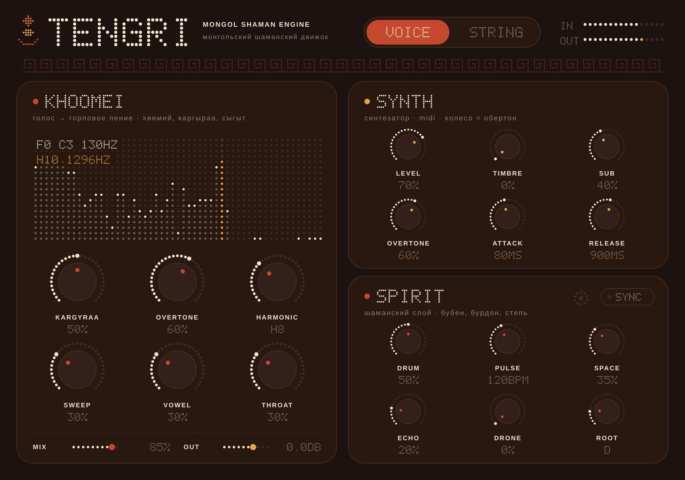
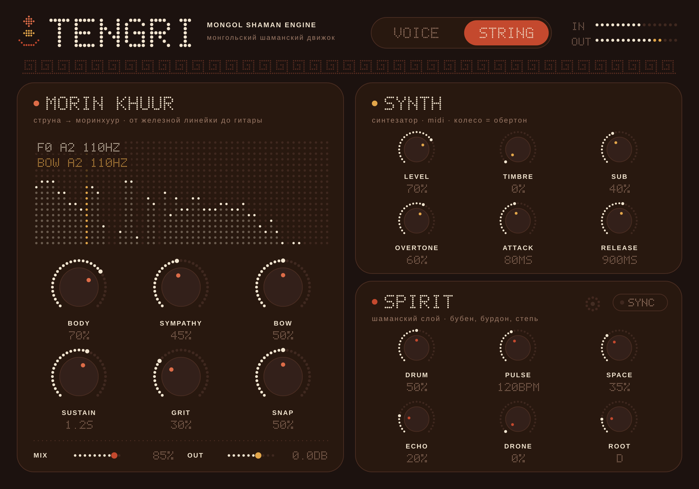

# TENGRI — Mongol Shaman Engine

VST3 / AU / Standalone плагин: монгольский шаманский синтезатор и преобразователь любого звука
в звучание горлового пения (хөөмий) и моринхуура. Дизайн в духе Nothing OS
(точечный dot-matrix шрифт, монохромные поверхности, одна красная точка), но в кирпичных,
глиняных и золотых цветах — с орнаментом «алхан хээ» и знаком соёмбо.




## Два плагина из одного кода

| Плагин | Тип | Когда использовать |
|---|---|---|
| **TENGRI FX** | эффект (принимает MIDI) | вешаете на дорожку с голосом, гитарой, линейкой и т.п. |
| **TENGRI** | инструмент | играете на синтезаторе с MIDI-клавиатуры; в хостах, где у инструмента можно включить аудиовход (Reaper, Bitwig и др.), он тоже работает как преобразователь |

В обоих есть все секции: преобразователь, синтезатор и шаманский слой.

## Режимы преобразования

Переключатель **VOICE / STRING** сверху. Высота входного звука отслеживается алгоритмом YIN
(50 Гц – 1 кГц), и по ней работают все эффекты.

### VOICE → KHOOMEI (голос → горловое пение)

| Ручка | Что делает |
|---|---|
| **KARGYRAA** | низкий рычащий призвук: удвоение периода (AM на f0/2) + субоктава, как в каргыраа |
| **OVERTONE** | сыгыт: свистящий обертон над голосом (узкий фильтр на гармонике + ресинтез) |
| **HARMONIC** | номер гармоники (H4…H16), на которой поёт обертон |
| **SWEEP** | обертонная мелодия: свист «ходит» по гармоникам 6…12, ручка задаёт скорость и размах |
| **VOWEL** | форма рта: гласная У → О → А → Э → И |
| **THROAT** | сдавленное горло: плотность и насыщение |

### STRING → MORIN KHUUR (любая струна → моринхуур)

Работает с чем угодно, что звенит: от железной линейки, прижатой к краю стола, до гитары, баса,
скрипки, укулеле или резинки.

| Ручка | Что делает |
|---|---|
| **BODY** | резонансы деревянного трапециевидного корпуса моринхуура |
| **SYMPATHY** | 4 симпатические струны, настроенные квартами от тоники (как у моринхуура) |
| **BOW** | смычок из конского волоса: ресинтез по отслеженной высоте, щипок превращается в протяжную ноту |
| **SUSTAIN** | сколько смычок тянет ноту после затухания источника (50 мс – 6 с) |
| **GRIT** | канифоль и конский волос: шершавость |
| **SNAP** | притяжение высоты смычка к монгольской пентатонике от тоники ROOT |

## SYNTH (MIDI)

Полифонический синтезатор на 8 голосов, та же модель горла и моринхуура.

| Ручка | Что делает |
|---|---|
| **LEVEL** | громкость |
| **TIMBRE** | 0% — горловой голос, 100% — моринхуур, между ними плавный переход |
| **SUB** | каргыраа-субоктава |
| **OVERTONE** | громкость свистящего обертона. Сам обертон блуждает по пентатонической мелодии гармоник; **колесо модуляции (CC1)** выбирает гармонику вручную |
| **ATTACK / RELEASE** | огибающая |

Pitch bend: ±2 полутона. Гласная берётся с ручки **VOWEL**.

## SPIRIT (шаманский слой)

| Ручка | Что делает |
|---|---|
| **DRUM** | хэц: бубен шамана с железными подвесками, транс-пульс «ДУМ-дум» |
| **PULSE** | темп бубна (40–240 BPM). Кнопка **SYNC**: темп и сетка хоста, бубен играет только во время воспроизведения |
| **SPACE** | пространство: степь, юрта, пещера (реверберация) |
| **ECHO** | пинг-понг эхо над степью, темнеет с каждым повтором |
| **DRONE** | бурдон на тонике: горловой в VOICE, моринхуур в STRING |
| **ROOT** | тоника: строй бурдона, симпатических струн и пентатоники |

Внизу: **MIX** (сухой ↔ обработанный) и **OUT** (выходная громкость, −24…+12 дБ).
Двойной клик по ручке сбрасывает её на значение по умолчанию; при наведении есть подсказки на русском.

## Советы

- **Голос:** пойте ровную гласную «а» или «о» в низком, удобном регистре. Потом крутите HARMONIC и SWEEP.
  Для глубокого каргыраа: KARGYRAA 70–100%, VOWEL ближе к «О», THROAT 40%.
- **Линейка:** прижмите стальную линейку к краю стола, запишите щелчок микрофоном или звукоснимателем.
  Режим STRING, BOW 70%, SUSTAIN 2–3 с, SNAP 100%, и каждый щелчок станет нотой моринхуура в пентатонике.
- **Гитара:** BODY 80%, SYMPATHY 50%, BOW 40%. Медленный перебор на одной струне ближе всего к моринхууру.
- **Шаманский транс:** DRUM 60%, PULSE 180–220, DRONE 40%, SPACE 60%.

## Где взять готовый плагин

Каждый push запускает GitHub Actions (**Actions → Build**), который собирает плагины под Windows, macOS
и Linux. Скачайте архив `TENGRI-Windows` / `TENGRI-macOS` / `TENGRI-Linux` из артефактов сборки.

Куда положить `.vst3`:
- **Windows:** `C:\Program Files\Common Files\VST3\`
- **macOS:** `~/Library/Audio/Plug-Ins/VST3/` (AU, файл `.component`, кладётся в `~/Library/Audio/Plug-Ins/Components/`).
  Плагины не подписаны, поэтому после копирования выполните
  `xattr -cr ~/Library/Audio/Plug-Ins/VST3/TENGRI*.vst3`
- **Linux:** `~/.vst3/`

## Сборка из исходников

Нужны CMake ≥ 3.22 и компилятор C++17. JUCE 8 скачается автоматически.

```bash
cmake -B build -DCMAKE_BUILD_TYPE=Release
cmake --build build --config Release --parallel
```

Готовые файлы окажутся в `build/Tengri_artefacts/Release/` и `build/TengriFX_artefacts/Release/`.

Для Linux понадобятся пакеты:
`libasound2-dev libx11-dev libxrandr-dev libxinerama-dev libxcursor-dev libxext-dev libfreetype-dev libfontconfig1-dev libgl1-mesa-dev`.

Опции:
- `-DTENGRI_JUCE_PATH=/path/to/JUCE` — взять локальную копию JUCE вместо скачивания;
- `-DTENGRI_BUILD_TOOLS=ON` — собрать `TengriRender`, офлайн-тест: прогоняет синтетический голос,
  гитару и линейку через оба режима, пишет WAV-файлы, проверяет уровни и точность трекинга высоты,
  сохраняет скриншоты интерфейса (`TengriRender <папка>`).

## Структура

```
Source/
  PluginProcessor.*   — маршрутизация, параметры, телеметрия для UI
  PluginEditor.*      — интерфейс
  Parameters.*        — все параметры
  SynthVoice.h        — голос синтезатора
  dsp/PitchTracker.h  — YIN-трекер высоты
  dsp/Transformers.h  — VOICE (хөөмий) и STRING (моринхуур)
  dsp/ThroatCore.h    — источник: горло / моринхуур (синт и бурдон)
  dsp/Spirit.h        — бубен-хэц и степное эхо
  ui/                 — dot-matrix шрифт, ручки, спектр, палитра
Tools/Render.cpp      — офлайн-тест
```

## Лицензия

Плагин построен на [JUCE 8](https://juce.com), который распространяется по лицензии AGPLv3 или по
коммерческой лицензии JUCE. Для закрытого коммерческого распространения нужна коммерческая лицензия JUCE.
